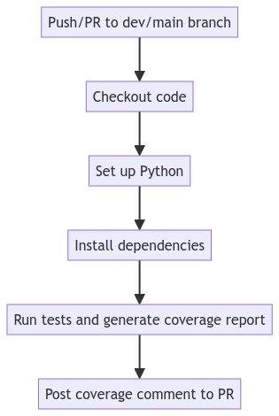

# Backend Deployment Documentation

## Overview

This document provides a detailed explanation of the backend deployment process, including
- the Continuous Deployment (CD) and Continuous Integration (CI) pipelines
- Docker images used and built
- Kubernetes deployment and configuration, environment configurations, secrets management, deployed components, jobs, and storage.

### Application Architecture


### Application Deployment

---
## Technologies Used

* **GitHub Actions**: For CI/CD automation.
* **Docker**: For containerization of the application.
* **Google Cloud Platform (GCP)**: For hosting the application and Kubernetes cluster management.
* **Kubernetes**: For container orchestration.
* **kubectl**: For Kubernetes command-line operations.
* **kustomize**: For managing Kubernetes configurations.
* **Python**: For running tests and generating code coverage reports.
* **Node.js**: For running Keycloak configuration scripts.
---
## CI Pipeline Workflow

### Trigger

The CI pipeline is triggered by:

* Push events to the `dev` or `main` branches.
* Pull requests targeting the `main` or `dev` branches.

### Jobs and Steps

The CI pipeline consists of a single job that performs the following steps:

#### Coverage Job

* **Runs-on**: `ubuntu-latest`
* **Permissions**: Grants write permissions to checks, pull-requests, and contents.

#### Steps

1. **Checkout code**
2. **Set up Python**
3. **Install dependencies**
4. **Run tests and generate coverage report**
5. **Post coverage comment to PR**
---
## CD Pipeline Workflow

### Trigger

The CD pipeline is triggered by a push event to the `main` or `dev` branches.

### Jobs and Steps

The pipeline consists of several jobs and steps executed sequentially:

#### Build Job

* **Runs-on**: `ubuntu-latest`
* **Services**: Uses Docker version 19.03.12 with `--privileged` option.

#### Steps

1. **Checkout code**
2. **Set up Docker Buildx**
3. **Log in to Docker Hub**
    * Logs into Docker Hub using secrets for username and password.
4. **Create .env file for backend dev**
    * Creates a `.env` file with development environment variables for the backend if the branch is `dev`.
5. **Create .env file for backend prod**
    * Creates a `.env` file with production environment variables for the backend if the branch is `main`.
6. **Create .env file for keycloak dev**
    * Creates a `.env` file with development environment variables for keycloak if the branch is `dev`.
7. **Create .env file for keycloak prod**
    * Creates a `.env` file with production environment variables for keycloak if the branch is `main`.
8. **Build and push Docker images**
    * Builds and pushes Docker images for the **backend service and Keycloak configuration**.
9. **Authenticate to Google Cloud**
10. **Set up Google Cloud SDK**
11. **Install gke-gcloud-auth-plugin**
12. **Authenticate to GKE**
13. **Install kubectl**
14. **Verify connection**
    * Verifies the connection to the Kubernetes cluster by listing nodes.
15. **Create namespaces**
    * Creates `prod` and `dev` namespaces depending on the branch.
16. **Create Secrets for Development**
    * If the branch is `dev`, creates Kubernetes secrets for the dev environment.
17. **Create Secrets for Production**
    * If the branch is `main`, creates Kubernetes secrets for the prod environment.
18. **Deploy to Development**
    * Deploys the application to the dev environment.
19. **Deploy to Production**
    * Deploys the application to the prod environment.
---
## Docker Images

### Overview

Docker is used to containerize the backend application and Keycloak configuration. This section provides details on the
Docker images used and built. in addition, public images are used for the databases (PostgreSQL and MySQL) and Keycloak.

### Backend Service Docker Image

The Docker image for the backend service is based on the Python 3.9 image. It installs the necessary dependencies and
sets the command to run the application.

### Keycloak Configuration Docker Image

The Docker image for Keycloak configuration is based on the Node.js 14 image. It installs the necessary dependencies and
sets the command to run the Keycloak configuration script.

### Building and Pushing Docker Images

In the CD pipeline, Docker images are built and pushed to Docker Hub using the following commands:

```bash
docker buildx build --push --tag ${{ secrets.DOCKER_USERNAME }}/backend-service:${{ github.sha }} ./app docker buildx build --push --tag ${{ secrets.DOCKER_USERNAME }}/configure-keycloak:${{ github.sha }} ./keycloak

docker buildx build --push --tag ${{ secrets.DOCKER_USERNAME }}/configure-keycloak:${{ github.sha }} ./keycloak
```

---
## Kubernetes Deployment and Configuration

### Overview

The Kubernetes deployment and configuration involve several components, including
- Deployments
- Services
- Jobs
- ConfigMaps
- Secrets
- PersistentVolumeClaims (PVCs).

These resources are defined in YAML files and managed using _kubectl_ and _kustomize_.

### Supporting Multiple Environments
The deployment process is designed to support two environments: development (dev) and production (prod).
This is achieved through the use of separate namespaces, ConfigMaps, and Secrets for each environment.
The Cd pipeline creates the necessary resources based on the branch being deployed.

### Backend Service Deployment

* **Deployment**: Defines the backend application deployment, including the number of replicas, the Docker image, and
  environment variables.
* **Service**: Exposes the backend application using a **LoadBalancer** on port **5000**.

### Keycloak Configuration

* **Keycloak Deployment**: Manages the Keycloak service, including the Docker image, environment variables, and startup
  commands.
* **Keycloak Service**: Exposes the Keycloak service using a **LoadBalancer** on port **8080**.
* **Keycloak Job**: A batch job that configures Keycloak using a specified Docker image and script.

### Database Deployment

* **PostgreSQL Deployment**: Manages the PostgreSQL database for Keycloak, including the Docker image, environment
  variables, and persistent storage.
* **PostgreSQL Service**: Exposes the PostgreSQL database within the cluster on port **5432**.
* **MySQL Deployment**: Manages the MySQL database for the backend service, including the Docker image, environment
  variables, and persistent storage.
* **MySQL Service**: Exposes the MySQL database within the cluster on port **3306**.

### Persistent Volume Claims (PVCs)

PVCs define the storage requirements for the databases, ensuring data persistence across pod restarts.
e.g., the PostgreSQL and MySQL deployments use PVCs to store data.

### ConfigMaps

ConfigMaps are used to store non-sensitive configuration data.
They allow decoupling of configuration from the docker image, making the image more portable.

Using Kustomize we have two sets of ConfigMaps for development and production environments.

* **backend-config**: Contains configuration for the backend service such as **database host and name**.
* **keycloak-db-config**: Contains configuration for the Keycloak database such as **the database name**.
* **keycloak-config**: Contains configuration for the Keycloak service such as **database vendor and address**.
* **mysql-config**: Contains configuration for the MySQL service such as **the database name and root host**.

### Environment Configuration

We store sensitive information in the GitHub secrets and then create Kubernetes secrets from them in the CD pipeline.
the secrets are then used in the Kubernetes deployment configurations.

#### _the secrets used in Deployment:_

* **DOCKER\_USERNAME**: Docker Hub username.
* **DOCKER\_PASSWORD**: Docker Hub password.
* **GCP\_SA\_KEY**: Google Cloud service account key.
* **GCP\_PROJECT**: Google Cloud project ID.
* **GKE\_ZONE**: GKE cluster zone.
* **GKE\_CLUSTER**: GKE cluster name.
* **DB\_USER\_DEV**: Database user for development environment.
* **DB\_PASSWORD\_DEV**: Database password for development environment.
* **DB\_USER\_PROD**: Database user for production environment.
* **DB\_PASSWORD\_PROD**: Database password for production environment.
* **POSTGRES\_USER**: Postgres user for Keycloak.
* **POSTGRES\_PASSWORD**: Postgres password for Keycloak.
* **KEYCLOAK\_ADMIN**: Keycloak admin user.
* **KEYCLOAK\_ADMIN\_PASSWORD**: Keycloak admin password.
* **MYSQL\_ROOT\_PASSWORD\_DEV**: MySQL root password for development environment.
* **MYSQL\_ROOT\_PASSWORD\_PROD**: MySQL root password for production environment.
* **KEYCLOAK\_URL\_DEV**: Keycloak URL for development environment.
* **KEYCLOAK\_REALM\_DEV**: Keycloak realm for development environment.
* **KEYCLOAK\_CLIENT\_ID\_DEV**: Keycloak client ID for development environment.
* **KEYCLOAK\_CLIENT\_SECRET\_DEV**: Keycloak client secret for development environment.
* **KEYCLOAK\_URL\_PROD**: Keycloak URL for production environment.
* **KEYCLOAK\_REALM\_PROD**: Keycloak realm for production environment.
* **KEYCLOAK\_CLIENT\_ID\_PROD**: Keycloak client ID for production environment.
* **KEYCLOAK\_CLIENT\_SECRET\_PROD**: Keycloak client secret for production environment.
* **GITHUB\_TOKEN**: GitHub token for posting coverage comments **_(automatically generated by GitHub Actions)_**.

<details><summary>Keycloak Config</summary>

* **CONFIG\_KEYCLOAK\_URL\_DEV**: Keycloak URL for the dev environment.
* **CONFIG\_KEYCLOAK\_ADMIN\_USERNAME\_DEV**: Admin username for the dev environment.
* **CONFIG\_KEYCLOAK\_ADMIN\_PASSWORD\_DEV**: Admin password for the dev environment.
* **CONFIG\_KEYCLOAK\_REALM\_NAME\_DEV**: Realm name for the dev environment.
* **CONFIG\_KEYCLOAK\_FRONTEND\_CLIENT\_ID\_DEV**: Frontend client ID for the dev environment.
* **CONFIG\_KEYCLOAK\_BACKEND\_CLIENT\_ID\_DEV**: Backend client ID for the dev environment.
* **CONFIG\_KEYCLOAK\_CLIENT\_SECRET\_DEV**: Client secret for the dev environment.
* **CONFIG\_KEYCLOAK\_USER\_USERNAME\_DEV**: Username for the dev environment.
* **CONFIG\_KEYCLOAK\_USER\_PASSWORD\_DEV**: User password for the dev environment.
* **CONFIG\_KEYCLOAK\_RECREATE\_REALM\_DEV**: Flag to recreate the realm in the dev environment.
* **CONFIG\_KEYCLOAK\_MAX\_RETRIES\_DEV**: Max retries for the dev environment, to wait until Keycloak is ready.
* **CONFIG\_KEYCLOAK\_RETRY\_INTERVAL\_DEV**: Retry interval for the dev environment, to wait until Keycloak is ready.
* **CONFIG\_KEYCLOAK\_REDIRECT\_URIS\_DEV**: Redirect URIs for the dev environment.
* **CONFIG\_KEYCLOAK\_WEB\_ORIGINS\_DEV**: Web origins for the dev environment.

* **CONFIG\_KEYCLOAK\_URL\_PROD**: Keycloak URL for the prod environment.
* **CONFIG\_KEYCLOAK\_ADMIN\_USERNAME\_PROD**: Admin username for the prod environment.
* **CONFIG\_KEYCLOAK\_ADMIN\_PASSWORD\_PROD**: Admin password for the prod environment.
* **CONFIG\_KEYCLOAK\_REALM\_NAME\_PROD**: Realm name for the prod environment.
* **CONFIG\_KEYCLOAK\_FRONTEND\_CLIENT\_ID\_PROD**: Frontend client ID for the prod environment.
* **CONFIG\_KEYCLOAK\_BACKEND\_CLIENT\_ID\_PROD**: Backend client ID for the prod environment.
* **CONFIG\_KEYCLOAK\_CLIENT\_SECRET\_PROD**: Client secret for the prod environment.
* **CONFIG\_KEYCLOAK\_USER\_USERNAME\_PROD**: Username for the prod environment.
* **CONFIG\_KEYCLOAK\_USER\_PASSWORD\_PROD**: User password for the prod environment.
* **CONFIG\_KEYCLOAK\_RECREATE\_REALM\_PROD**: Flag to recreate the realm in the prod environment.
* **CONFIG\_KEYCLOAK\_MAX\_RETRIES\_PROD**: Max retries for the prod environment, to wait until Keycloak is ready.
* **CONFIG\_KEYCLOAK\_RETRY\_INTERVAL\_PROD**: Retry interval for the prod environment, to wait until Keycloak is ready.
* **CONFIG\_KEYCLOAK\_REDIRECT\_URIS\_PROD**: Redirect URIs for the prod environment.
* **CONFIG\_KEYCLOAK\_WEB\_ORIGINS\_PROD**: Web origins for the prod environment.

</details>


---
## Diagrams

### CI Pipeline Workflow Diagram



### CD Pipeline Workflow Diagram


### Kubernetes Deployment Diagram


---
## Conclusion

- _**Automated CI/CD Pipelines:**_ The CI/CD pipelines automate the process of building, testing, and deploying the backend application, ensuring consistency and efficiency.
- _**Secure Configuration Management:**_ Sensitive data is securely managed using GitHub and Kubernetes secrets, maintaining the integrity and confidentiality of environment-specific configurations.
- _**Scalable and Portable Infrastructure:**_ The use of Docker and Kubernetes ensures application portability, scalability, and reliability.